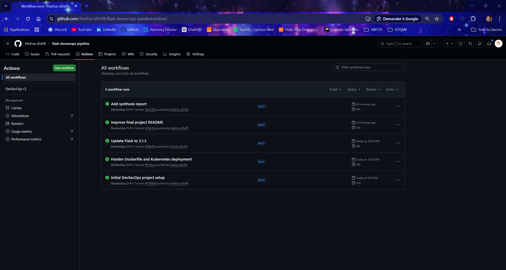
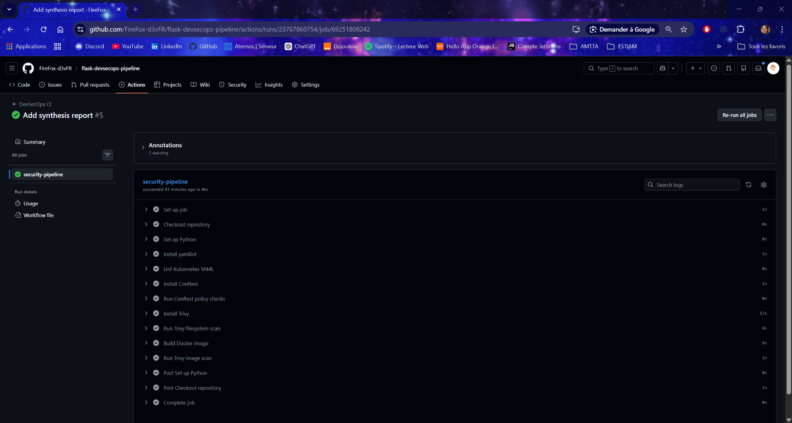
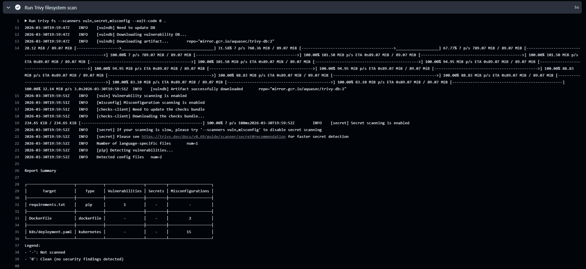
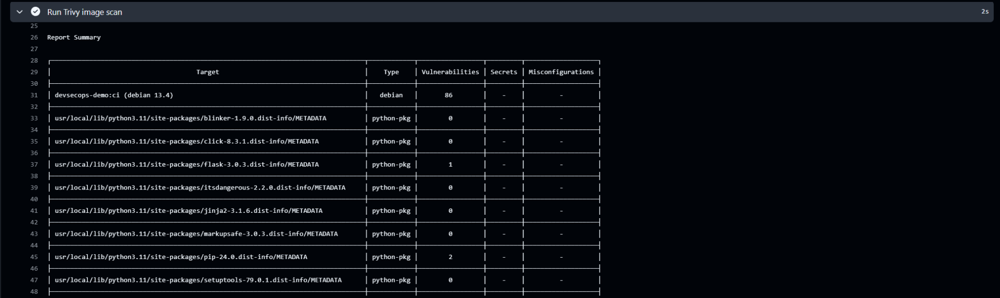

# Rapport synthétique — Projet DevSecOps

## 1. Contexte et objectif

L’objectif de ce projet était de mettre en place un pipeline DevSecOps autour d’une petite application Flask conteneurisée.  
Le but était d’intégrer des contrôles de sécurité directement dans une chaîne CI/CD avec GitHub Actions, afin de détecter des vulnérabilités dans les dépendances, les images Docker et les fichiers de configuration.  
Le projet devait aussi inclure une règle de sécurité codifiée avec Conftest, ainsi qu’un rapport de synthèse sur les vulnérabilités observées et les recommandations.

## 2. Lien du dépôt GitHub et exécution du pipeline

Dépôt GitHub du projet : `https://github.com/FireFox-d3vFR/flask-devsecops-pipeline`

Le pipeline a été exécuté avec succès dans GitHub Actions.  
Les différentes étapes automatisées permettent de valider la configuration YAML, de contrôler une règle de sécurité Kubernetes, de scanner les dépendances et le système de fichiers avec Trivy, puis de construire et scanner l’image Docker.

### 2.1 Capture - Vue générale du workflow GitHub Actions



### 2.2 Capture - Détail du job security-pipeline



## 3. Architecture du projet

Le projet repose sur une petite API Flask avec :
- un fichier `app.py` ;
- un fichier `requirements.txt` ;
- un `Dockerfile` ;
- un manifeste Kubernetes `k8s/deployment.yaml` ;
- une règle Rego `policy/kubernetes.rego` ;
- un pipeline GitHub Actions dans `.github/workflows/ci.yml`.

Le pipeline exécute plusieurs étapes automatisées :
- lint YAML avec `yamllint` ;
- contrôle de politique de sécurité avec `Conftest` ;
- scan filesystem avec `Trivy fs` ;
- build de l’image Docker ;
- scan de l’image avec `Trivy image`.

## 4. Outils utilisés

Les principaux outils utilisés dans ce projet sont :
- **GitHub Actions** pour le pipeline CI ;
- **Flask** pour l’application de démonstration ;
- **Docker** pour la conteneurisation ;
- **Kubernetes YAML** pour le déploiement ;
- **yamllint** pour la validation syntaxique des fichiers YAML ;
- **Conftest** pour la vérification de règles de sécurité ;
- **Trivy** pour le scan de vulnérabilités et de mauvaises configurations.

## 5. Pipeline GitHub Actions

Le fichier principal du pipeline est : `.github/workflows/ci.yml`

Le workflow automatise les étapes suivantes :
1. récupération du dépôt ;
2. installation de Python ;
3. installation et exécution de `yamllint` ;
4. installation et exécution de `Conftest` ;
5. installation et exécution de `Trivy fs` ;
6. build de l’image Docker ;
7. exécution de `Trivy image`.

Extrait représentatif du workflow :

```yaml
name: DevSecOps CI

on:
  push:
    branches:
      - main
      - master
  pull_request:

jobs:
  security-pipeline:
    runs-on: ubuntu-latest
```

Ce pipeline permet d’intégrer la sécurité directement dans la CI, au lieu de la traiter uniquement à la fin du cycle de développement.

## 6. Résultats du premier scan

Lors des premiers scans, plusieurs problèmes ont été détectés.

### 6.1 Dépendances
Le scan Trivy a détecté une vulnérabilité sur la dépendance Flask utilisée dans `requirements.txt`.  
La version `Flask 3.0.3` présentait une vulnérabilité corrigée dans une version plus récente.

### 6.2 Dockerfile
Le `Dockerfile` initial présentait des mauvaises configurations :
- absence d’utilisateur non-root ;
- absence de `HEALTHCHECK`.

### 6.3 Kubernetes
Le manifeste Kubernetes présentait plusieurs faiblesses de configuration, notamment :
- manque de paramètres complets dans le `securityContext` ;
- absence de `allowPrivilegeEscalation: false` ;
- absence de `readOnlyRootFilesystem: true` ;
- absence de `capabilities.drop` ;
- absence de `seccompProfile` ;
- absence de limites et requêtes de ressources ;
- utilisation implicite du namespace par défaut.

### 6.4 Image Docker
Le scan de l’image Docker a également remonté un nombre important de vulnérabilités système dans l’image de base Debian.  
Cela montre qu’une partie des vulnérabilités ne vient pas directement du code applicatif, mais aussi de la base système utilisée pour construire l’image.

## 7. Scan Trivy

Trivy a été utilisé à deux niveaux :

- `Trivy fs` pour analyser les dépendances et les fichiers du projet ;
- `Trivy image` pour analyser l’image Docker construite dans le pipeline.

### 7.1 Résultats avant correction

Avant correction :

- `requirements.txt` contenait 1 vulnérabilité détectée par Trivy ;
- le `Dockerfile` présentait 2 mauvaises configurations ;
- le manifeste `k8s/deployment.yaml` présentait 15 mauvaises configurations.

### 7.2 Résultats après correction

Après correction :

- `requirements.txt` ne remonte plus de vulnérabilité ;
- le `Dockerfile` ne remonte plus de mauvaise configuration ;
- le manifeste Kubernetes ne remonte plus de mauvaise configuration.

Les vulnérabilités restantes concernent surtout :

- l’image de base système ;
- certains paquets présents dans l’environnement Python de l’image.

### 7.3 Interprétation

Les résultats montrent que les corrections appliquées ont permis d’éliminer les problèmes de configuration et la vulnérabilité applicative initiale.

En revanche, le scan d’image montre qu’il reste des vulnérabilités système, ce qui met en évidence l’importance du choix et de la maintenance de l’image de base.

### 7.4 Capture - Résultats `Trivy filesystem scan` avant correction

La capture ci-dessous montre le résumé du scan `Trivy fs` avant correction.  
On observe :
- 1 vulnérabilité sur `requirements.txt` ;
- 2 mauvaises configurations sur le `Dockerfile` ;
- 15 mauvaises configurations sur `k8s/deployment.yaml`.



### 7.5 Capture - Résultats `Trivy filesystem scan` après correction

La capture ci-dessous montre le résumé du scan `Trivy fs` après correction.  
Les résultats indiquent que :
- `requirements.txt` ne remonte plus de vulnérabilité ;
- le `Dockerfile` ne remonte plus de mauvaise configuration ;
- le manifeste Kubernetes ne remonte plus de mauvaise configuration.


### 7.6 Capture - Trivy image scan avant correction

La capture ci-dessous montre le résumé du scan `Trivy image` avant correction.  
On y observe :
- de nombreuses vulnérabilités dans l’image de base Debian ;
- une vulnérabilité encore présente sur la dépendance `Flask 3.0.3` embarquée dans l’image ;
- d’autres composants Python sans vulnérabilité signalée à ce stade.



### 7.7 Capture — Trivy image scan après correction

La capture ci-dessous montre le résumé du scan `Trivy image` après correction.  
On constate que :
- `Flask 3.1.3` ne remonte plus de vulnérabilité ;
- les vulnérabilités restantes concernent principalement l’image de base Debian et certains paquets système ou outils intégrés à l’environnement Python.


## 8. Politique de sécurité avec Conftest

Une règle Rego a été mise en place avec Conftest pour refuser un déploiement Kubernetes si le conteneur n’est pas configuré pour tourner en non-root.

Exemple de règle utilisée :

```rego
package main

deny contains msg if {
  input.kind == "Deployment"
  container := input.spec.template.spec.containers[_]
  not container.securityContext.runAsNonRoot
  msg := sprintf("Container '%s' must set securityContext.runAsNonRoot to true", [container.name])
}
```

Cette règle a d’abord permis de faire échouer le contrôle sur un manifeste insuffisamment sécurisé, puis de valider la correction après ajout du `securityContext`.

Le résultat final du contrôle est conforme, avec un passage réussi de la policy dans le pipeline.

### 8.1 Sortie en échec avant correction

```bash
./.local/bin/conftest test k8s/deployment.yaml --policy policy
FAIL - k8s/deployment.yaml - main - Container 'devsecops-demo' must set securityContext.runAsNonRoot to true

2 tests, 1 passed, 0 warnings, 1 failure, 0 exceptions
```

### 8.2 Sortie en succès après première correction

```bash
./.local/bin/conftest test k8s/deployment.yaml --policy policy

2 tests, 2 passed, 0 warnings, 0 failures, 0 exceptions
```

### 8.3 Sortie après durcissement plus complet

```bash
./.local/bin/conftest test k8s/deployment.yaml --policy policy

3 tests, 3 passed, 0 warnings, 0 failures, 0 exceptions
```

## 9. Mesures correctives mises en place

Plusieurs corrections ont été apportées au projet afin d’améliorer la posture de sécurité.

### 9.1 Correction du Dockerfile
Le `Dockerfile` a été durci en :
- ajoutant un utilisateur non-root ;
- ajoutant un `HEALTHCHECK` ;
- ajustant les permissions sur le répertoire applicatif.

### 9.2 Correction du manifeste Kubernetes
Le fichier `k8s/deployment.yaml` a été renforcé avec :
- `runAsNonRoot: true` ;
- `runAsUser` et `runAsGroup` ;
- `allowPrivilegeEscalation: false` ;
- `readOnlyRootFilesystem: true` ;
- `capabilities.drop: [ALL]` ;
- `seccompProfile: RuntimeDefault` ;
- des `resources.requests` et `resources.limits` ;
- un namespace dédié `devsecops`.

### 9.3 Mise à jour des dépendances
La dépendance Flask a été mise à jour de `3.0.3` vers `3.1.3` afin de corriger la vulnérabilité détectée dans le scan des dépendances.

## 10. Analyse sécurité

Ce projet montre qu’une démarche DevSecOps ne consiste pas seulement à lancer des outils, mais à mettre en place une logique d’amélioration continue.  
Les premiers scans ont permis de détecter des défauts de configuration et une dépendance vulnérable.  
Les corrections apportées ont ensuite permis de réduire fortement les problèmes remontés par le pipeline.  
Cela illustre bien l’intérêt d’intégrer la sécurité le plus tôt possible dans le cycle de développement, avec des contrôles automatisés directement dans la CI.

Le projet montre aussi qu’il existe plusieurs niveaux de sécurité :
- la sécurité du code et des dépendances ;
- la sécurité du conteneur ;
- la sécurité du déploiement Kubernetes ;
- la sécurité de l’image de base.

Même si certaines vulnérabilités système restent présentes, le pipeline permet au moins de les rendre visibles et de guider les futures actions de remédiation.

## 11. Recommandations

Pour aller plus loin, plusieurs améliorations pourraient être envisagées :
- utiliser une image de base encore plus minimale ou mieux maintenue ;
- mettre en place un seuil bloquant sur certaines vulnérabilités critiques ;
- générer un SBOM dans le pipeline ;
- ajouter d’autres contrôles de sécurité comme le scan de secrets dédié ou du SAST ;
- stocker les résultats de scan sous forme d’artefacts ;
- compléter le déploiement Kubernetes avec d’autres règles de sécurité plus avancées.

## 12. Synthèse des résultats

Le projet montre une amélioration nette entre le premier état du pipeline et la version finale.

Avant correction :
- `requirements.txt` contenait 1 vulnérabilité détectée par Trivy ;
- le `Dockerfile` présentait 2 mauvaises configurations ;
- le manifeste `k8s/deployment.yaml` présentait 15 mauvaises configurations.

Après correction :
- `requirements.txt` ne remonte plus de vulnérabilité ;
- le `Dockerfile` ne remonte plus de mauvaise configuration ;
- le manifeste Kubernetes ne remonte plus de mauvaise configuration ;
- la policy Conftest passe correctement dans le pipeline.

Cette évolution montre que les outils intégrés dans le pipeline n’ont pas seulement servi à détecter des problèmes, mais aussi à guider leur correction de manière progressive.

## 13. Conclusion

Ce projet a permis de mettre en place un pipeline DevSecOps simple mais complet autour d’une application Flask.  
Les outils intégrés dans GitHub Actions ont permis d’automatiser le lint, le contrôle de politique, le scan des dépendances, le scan de configuration et le scan d’image.  
Les premiers résultats ont mis en évidence plusieurs faiblesses de sécurité, qui ont ensuite été corrigées progressivement.  
Le résultat final montre une nette amélioration de la posture de sécurité du projet, avec un pipeline capable de détecter, contrôler et accompagner la remédiation de plusieurs types de risques.
