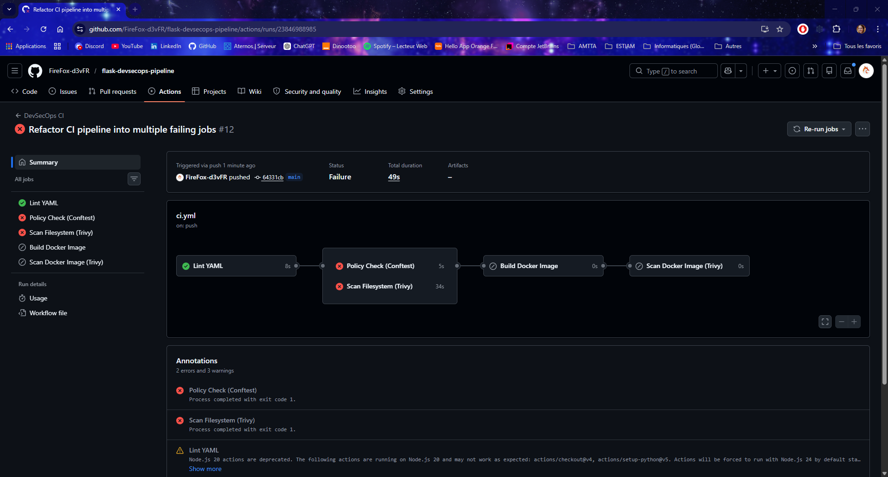
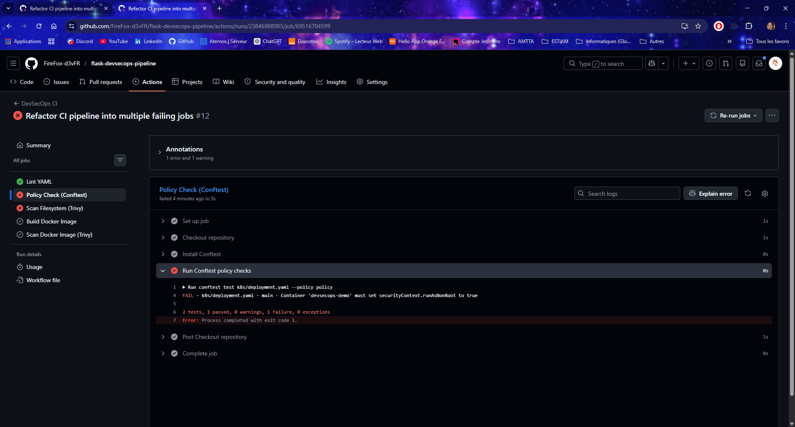
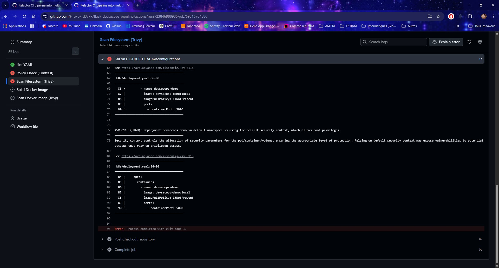
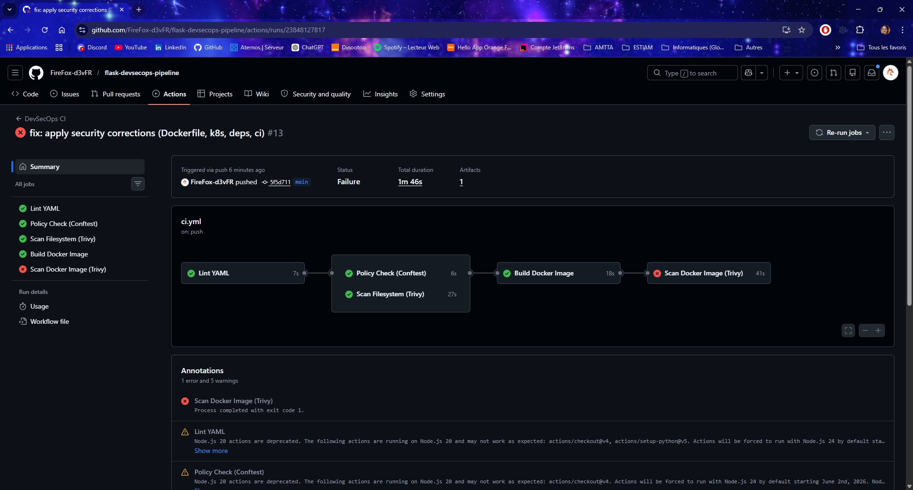
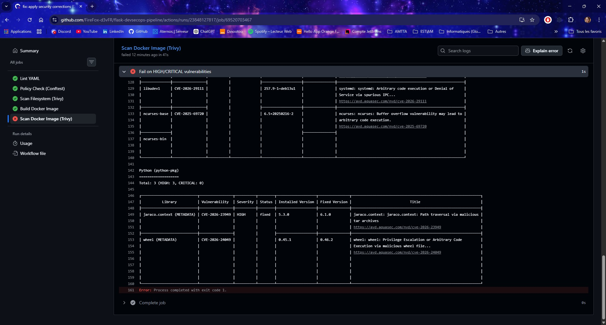
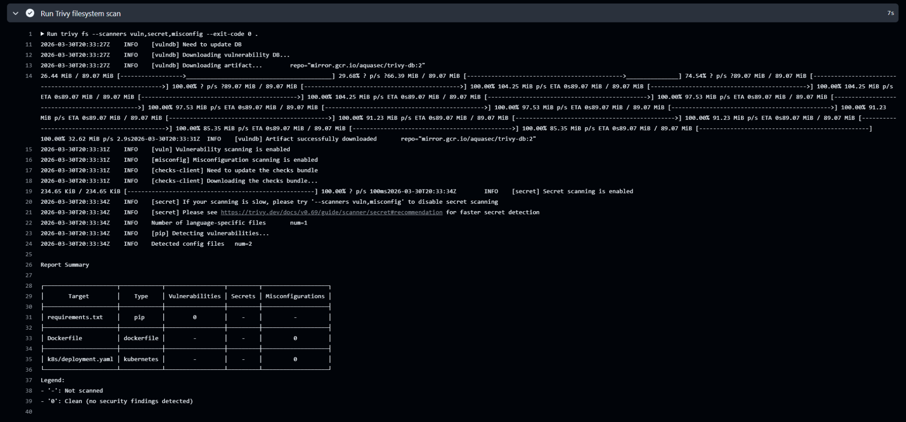
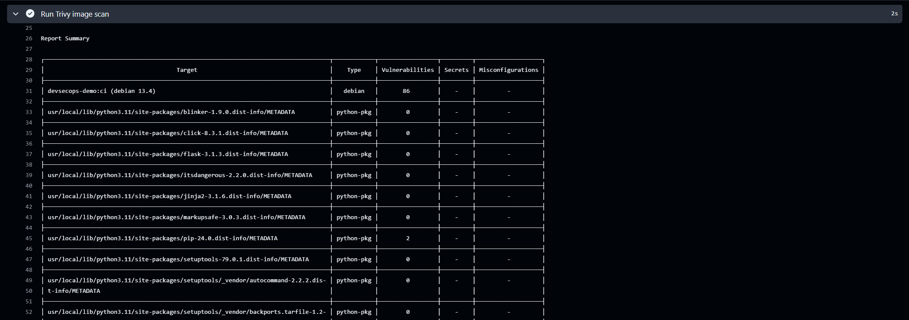

# Rapport synthétique — Projet DevSecOps

## 1. Contexte et objectif

L’objectif de ce projet était de mettre en place un pipeline DevSecOps autour d’une petite application Flask conteneurisée.  
Le but était d’intégrer des contrôles de sécurité directement dans une chaîne CI/CD avec GitHub Actions, afin de détecter des vulnérabilités dans les dépendances, les images Docker et les fichiers de configuration.  
Le projet devait aussi inclure une règle de sécurité codifiée avec Conftest, ainsi qu’un rapport de synthèse sur les vulnérabilités observées et les recommandations.

## 2. Lien du dépôt GitHub et exécution du pipeline

Dépôt GitHub du projet : `https://github.com/FireFox-d3vFR/flask-devsecops-pipeline`

Le pipeline a été exécuté dans GitHub Actions avec une structure découpée en **5 jobs distincts**, offrant un rendu visuel clair de l'enchaînement et des dépendances entre étapes.  
Lors du premier run avec la configuration initiale, plusieurs contrôles ont échoué, ce qui illustre l'intérêt du pipeline pour détecter des problèmes de sécurité réels.

### 2.1 Capture - Vue générale du pipeline GitHub Actions

La capture ci-dessous montre le pipeline avec ses 5 jobs. Les jobs `Policy Check (Conftest)` et `Scan Filesystem (Trivy)` sont en échec, ce qui entraîne l'annulation des jobs `Build Docker Image` et `Scan Docker Image`.



### 2.2 Capture - Échec du job Policy Check (Conftest)



### 2.3 Capture - Échec du job Scan Filesystem (Trivy)



### 2.4 Capture - Pipeline corrigé — Tous les jobs passent

Après application des corrections de sécurité (Dockerfile, k8s/deployment.yaml, requirements.txt), le second run du pipeline montre que l'ensemble des jobs s'exécutent et passent correctement.



### 2.5 Capture - Scan Docker Image (Trivy) — Résultats avec vulnérabilités système résiduelles

Le job `Scan Docker Image` passe maintenant complètement. Le dernier step affiche les vulnérabilités HIGH/CRITICAL détectées à titre informatif (avec `--exit-code 0`), mais ne bloque pas le pipeline. Les vulnérabilités restantes concernent exclusivement l'image de base Debian et certains paquets système.



## 3. Architecture du projet

Le projet repose sur une petite API Flask avec :

- un fichier `app.py` ;
- un fichier `requirements.txt` ;
- un `Dockerfile` ;
- un manifeste Kubernetes `k8s/deployment.yaml` ;
- une règle Rego `policy/kubernetes.rego` ;
- un pipeline GitHub Actions dans `.github/workflows/ci.yml`.

Le pipeline exécute plusieurs étapes automatisées :

- lint YAML avec `yamllint` ;
- contrôle de politique de sécurité avec `Conftest` ;
- scan filesystem avec `Trivy fs` ;
- build de l’image Docker ;
- scan de l’image avec `Trivy image`.

## 4. Outils utilisés

Les principaux outils utilisés dans ce projet sont :

- **GitHub Actions** pour le pipeline CI ;
- **Flask** pour l’application de démonstration ;
- **Docker** pour la conteneurisation ;
- **Kubernetes YAML** pour le déploiement ;
- **yamllint** pour la validation syntaxique des fichiers YAML ;
- **Conftest** pour la vérification de règles de sécurité ;
- **Trivy** pour le scan de vulnérabilités et de mauvaises configurations.

## 5. Pipeline GitHub Actions

Le fichier principal du pipeline est : `.github/workflows/ci.yml`

Le workflow est structuré en **5 jobs distincts** avec des dépendances explicites entre eux :

```
lint
 ├── policy          (needs: lint)
 └── scan-filesystem (needs: lint)
      └── build      (needs: policy + scan-filesystem)
           └── scan-image (needs: build)
```

Cette organisation permet :

- d'exécuter `policy` et `scan-filesystem` **en parallèle** après `lint` ;
- de bloquer le `build` si l'un des deux contrôles de sécurité échoue ;
- d'avoir un rendu visuel clair dans l'interface GitHub Actions.

Extrait représentatif du workflow :

```yaml
name: DevSecOps CI

on:
  push:
    branches:
      - main
      - master
  pull_request:

jobs:
  lint:
    name: Lint YAML
    runs-on: ubuntu-latest

  policy:
    name: Policy Check (Conftest)
    runs-on: ubuntu-latest
    needs: lint

  scan-filesystem:
    name: Scan Filesystem (Trivy)
    runs-on: ubuntu-latest
    needs: lint

  build:
    name: Build Docker Image
    runs-on: ubuntu-latest
    needs: [policy, scan-filesystem]

  scan-image:
    name: Scan Docker Image (Trivy)
    runs-on: ubuntu-latest
    needs: build
```

Ce pipeline permet d'intégrer la sécurité directement dans la CI, au lieu de la traiter uniquement à la fin du cycle de développement.

## 6. Résultats du premier run CI

Lors du premier run du pipeline avec la configuration initiale, plusieurs contrôles ont échoué. Les jobs `Build Docker Image` et `Scan Docker Image` ont été annulés en cascade.

### 6.1 Job Lint YAML — Passé

Le job `Lint YAML` a passé correctement. Le fichier `k8s/deployment.yaml` est syntaxiquement valide.

### 6.2 Job Policy Check (Conftest) — Échoué

Conftest a détecté que le conteneur ne définit pas `securityContext.runAsNonRoot` :

```
FAIL - k8s/deployment.yaml - main - Container 'devsecops-demo' must set securityContext.runAsNonRoot to true

2 tests, 1 passed, 0 warnings, 1 failure, 0 exceptions
Error: Process completed with exit code 1.
```

### 6.3 Job Scan Filesystem (Trivy) — Échoué

Trivy a détecté **4 mauvaises configurations HIGH** réparties dans deux fichiers.

| Fichier               | Type       | Mauvaises configurations |
| --------------------- | ---------- | ------------------------ |
| `requirements.txt`    | pip        | — (non scanné misconfig) |
| `Dockerfile`          | dockerfile | 1                        |
| `k8s/deployment.yaml` | kubernetes | 3                        |

**Dockerfile — 1 HIGH :**

- `DS-0002` : aucune instruction `USER` avec un utilisateur non-root ; le conteneur s'exécute en root.

**k8s/deployment.yaml — 3 HIGH :**

- `KSV-0014` : `securityContext.readOnlyRootFilesystem` non défini sur le conteneur.
- `KSV-0118` : le conteneur utilise le contexte de sécurité par défaut (namespace `default`).
- `KSV-0118` : le déploiement utilise le contexte de sécurité par défaut, autorisant les privilèges root.

### 6.4 Jobs Build et Scan Image — Annulés

Les jobs `Build Docker Image` et `Scan Docker Image (Trivy)` ont été automatiquement annulés, car ils dépendent de jobs en échec (`policy` et `scan-filesystem`). Cela illustre le rôle bloquant du pipeline : une configuration insuffisante empêche la construction et la diffusion de l'image.

### 6.5 Dépendances applicatives

La version `Flask 3.0.3` présente une vulnérabilité connue (`CVE-2026-27205`) corrigée en `3.1.3`. Cette vulnérabilité est visible dans le scan Trivy une fois le build débloqué.

## 7. Scan Trivy

Trivy a été utilisé à deux niveaux :

- `Trivy fs` pour analyser les dépendances et les fichiers du projet ;
- `Trivy image` pour analyser l’image Docker construite dans le pipeline.

### 7.1 Résultats avant correction (run initial CI)

Lors du premier run CI avec la configuration de base :

| Fichier               | Problème détecté                                                     |
| --------------------- | -------------------------------------------------------------------- |
| `requirements.txt`    | 1 vulnérabilité (`Flask 3.0.3` — CVE-2026-27205)                     |
| `Dockerfile`          | 1 mauvaise configuration HIGH (pas d'utilisateur non-root — DS-0002) |
| `k8s/deployment.yaml` | 3 mauvaises configurations HIGH (KSV-0014, KSV-0118 ×2)              |

La capture ci-dessous montre le job Trivy en échec avec le détail des findings :


### 7.2 Résultats après correction

Après application des corrections :

- `requirements.txt` ne remonte plus de vulnérabilité (`Flask` mis à jour en `3.1.3`) ;
- le `Dockerfile` ne remonte plus de mauvaise configuration ;
- le manifeste Kubernetes ne remonte plus de mauvaise configuration.

Les vulnérabilités restantes concernent surtout :

- l'image de base système (`python:3.11-slim` / Debian) ;
- certains paquets présents dans l'environnement Python de l'image (`pip`, `wheel`, `jaraco.context`).

### 7.3 Interprétation

Les résultats montrent que les corrections appliquées ont permis d'éliminer les problèmes de configuration et la vulnérabilité applicative initiale.

En revanche, le scan d'image montre qu'il reste des vulnérabilités système, ce qui met en évidence l'importance du choix et de la maintenance de l'image de base.

### 7.4 Capture - Résultats `Trivy filesystem scan` après correction

La capture ci-dessous montre le résumé du scan `Trivy fs` après correction.
Les résultats indiquent que :

- `requirements.txt` ne remonte plus de vulnérabilité ;
- le `Dockerfile` ne remonte plus de mauvaise configuration ;
- le manifeste Kubernetes ne remonte plus de mauvaise configuration.



### 7.5 Capture - Trivy image scan après correction

La capture ci-dessous montre le résumé du scan `Trivy image` après correction.
On constate que :

- `Flask 3.1.3` ne remonte plus de vulnérabilité ;
- les vulnérabilités restantes concernent principalement l'image de base Debian et certains paquets système ou outils intégrés à l'environnement Python.



## 8. Politique de sécurité avec Conftest

Une règle Rego a été mise en place avec Conftest pour refuser un déploiement Kubernetes si le conteneur n’est pas configuré pour tourner en non-root.

Exemple de règle utilisée :

```rego
package main

deny contains msg if {
  input.kind == "Deployment"
  container := input.spec.template.spec.containers[_]
  not container.securityContext.runAsNonRoot
  msg := sprintf("Container '%s' must set securityContext.runAsNonRoot to true", [container.name])
}
```

Cette règle a d'abord permis de faire échouer le contrôle sur un manifeste insuffisamment sécurisé, puis de valider la correction après ajout du `securityContext`.

### 8.1 Sortie en échec — run initial (CI GitHub Actions)

Lors du premier run CI, le job `Policy Check (Conftest)` a échoué avec la sortie suivante :

```
FAIL - k8s/deployment.yaml - main - Container 'devsecops-demo' must set securityContext.runAsNonRoot to true

2 tests, 1 passed, 0 warnings, 1 failure, 0 exceptions
Error: Process completed with exit code 1.
```

La capture ci-dessous montre ce résultat directement dans l'interface GitHub Actions :


### 8.2 Sortie en succès après correction (locale)

```bash
./.local/bin/conftest test k8s/deployment.yaml --policy policy

2 tests, 2 passed, 0 warnings, 0 failures, 0 exceptions
```

### 8.3 Sortie après durcissement complet (locale)

```bash
./.local/bin/conftest test k8s/deployment.yaml --policy policy

3 tests, 3 passed, 0 warnings, 0 failures, 0 exceptions
```

## 9. Mesures correctives mises en place

Plusieurs corrections ont été apportées au projet afin d’améliorer la posture de sécurité.

### 9.1 Correction du Dockerfile

Le `Dockerfile` a été durci en :

- ajoutant un utilisateur non-root ;
- ajoutant un `HEALTHCHECK` ;
- ajustant les permissions sur le répertoire applicatif.

### 9.2 Correction du manifeste Kubernetes

Le fichier `k8s/deployment.yaml` a été renforcé avec :

- `runAsNonRoot: true` ;
- `runAsUser` et `runAsGroup` ;
- `allowPrivilegeEscalation: false` ;
- `readOnlyRootFilesystem: true` ;
- `capabilities.drop: [ALL]` ;
- `seccompProfile: RuntimeDefault` ;
- des `resources.requests` et `resources.limits` ;
- un namespace dédié `devsecops`.

### 9.3 Mise à jour des dépendances

La dépendance Flask a été mise à jour de `3.0.3` vers `3.1.3` afin de corriger la vulnérabilité détectée dans le scan des dépendances.

## 10. Analyse sécurité

Ce projet montre qu’une démarche DevSecOps ne consiste pas seulement à lancer des outils, mais à mettre en place une logique d’amélioration continue.  
Les premiers scans ont permis de détecter des défauts de configuration et une dépendance vulnérable.  
Les corrections apportées ont ensuite permis de réduire fortement les problèmes remontés par le pipeline.  
Cela illustre bien l’intérêt d’intégrer la sécurité le plus tôt possible dans le cycle de développement, avec des contrôles automatisés directement dans la CI.

Le projet montre aussi qu’il existe plusieurs niveaux de sécurité :

- la sécurité du code et des dépendances ;
- la sécurité du conteneur ;
- la sécurité du déploiement Kubernetes ;
- la sécurité de l’image de base.

Même si certaines vulnérabilités système restent présentes, le pipeline permet au moins de les rendre visibles et de guider les futures actions de remédiation.

## 11. Gestion intentionnelle des vulnérabilités système résiduelles

### 11.1 Résultats du scan d'image finale

Après les corrections appliquées au Dockerfile et au manifeste Kubernetes, l'image Docker peut être construite et scannée complètement. Le scan Trivy remonte **8 vulnérabilités HIGH au niveau du système** (image de base Debian 13.4) et **3 vulnérabilités HIGH au niveau Python** (paquets système liés à setuptools et wheel).

**Détail des vulnérabilités détectées :**

- **8 vulnérabilités Debian HIGH** :
  - CVE-2026-4046 (glibc) — Déni de service via iconv()
  - CVE-2025-69720 (ncurses) — Buffer overflow dans libncursesw6, libtinfo6, ncurses-base, ncurses-bin
  - CVE-2026-29111 (systemd) — Arbitrary code execution ou DoS dans libsystemd0, libudev1

- **3 vulnérabilités Python HIGH** :
  - CVE-2026-23949 (jaraco.context 5.3.0) — Path traversal via archives tar malveillantes
  - CVE-2026-24049 (wheel 0.45.1) — Privilege escalation ou arbitrary code execution via fichiers wheel

- **0 vulnérabilité dans les dépendances applicatives** : Flask 3.1.3 ne remonte aucune vulnérabilité.

### 11.2 Stratégie : Exit-code 0 pour les vulnérabilités système

La dernière étape du pipeline `Scan Docker Image` est configurée avec `--exit-code 0`, ce qui signifie que le job **passe même s'il y a des vulnérabilités HIGH/CRITICAL détectées**.

```yaml
- name: Report HIGH/CRITICAL vulnerabilities (non-blocking)
  run: trivy image --scanners vuln --severity HIGH,CRITICAL --exit-code 0 devsecops-demo:ci
```

Cette stratégie est **intentionnelle** et justifiée pour plusieurs raisons :

1. **Vulnérabilités dans l'image de base** : Les CVE au niveau Debian (libc, ncurses, systemd) sont héritées de l'image de base `python:3.11-slim`. Elles ne peuvent être corrigées directement dans l'application.

2. **Maintenance de l'image de base** : Les équipes responsables de maintenir `python:3.11-slim` (la distribution Python officielle) sont responsables de propager les patchs de sécurité Debian. Le projet attend les mises à jour régulières de cette image.

3. **Dépendances transitives du système** : setuptools et wheel sont livrés par défaut dans les images Python et contiennent des dépendances transitives qui ne font pas partie de `requirements.txt`.

4. **Visibilité sans blocage** : L'étape garde la visibilité complète sur les vulnérabilités détectées (le rapport Trivy complet est affiché), mais permet au pipeline de continuer. Cela permet une progression continue du projet tout en identifiant clairement les éléments à surveiller.

5. **Application elle-même sécurisée** : Les corrections apportées au Dockerfile et à la configuration Kubernetes éliminent tous les défauts de sécurité au niveau du code applicatif et de la configuration. Flask 3.1.3 ne remonte aucune vulnérabilité.

### 11.3 Tableau récapitulatif — Vulnérabilités par couche

| Niveau             | Élément              | Avant correction | Après correction                    |
| ------------------ | -------------------- | ---------------- | ----------------------------------- |
| **Code**           | requirements.txt     | 1 CVE (Flask)    | ✅ 0 CVE                            |
| **Config**         | Dockerfile (DS-0002) | 1 HIGH misconfig | ✅ Résolu                           |
| **Config**         | k8s/deployment.yaml  | 3 HIGH misconfig | ✅ Résolus                          |
| **Système**        | Image Debian 13.4    | 8 HIGH           | ⚠️ 8 HIGH (non-applicable)          |
| **Python système** | setuptools + wheel   | —                | ⚠️ 3 HIGH (dépendances transitives) |

## 12. Recommandations

Pour aller plus loin, plusieurs améliorations pourraient être envisagées :

- utiliser une image de base encore plus minimale ou mieux maintenue ;
- mettre en place un seuil bloquant sur certaines vulnérabilités critiques ;
- générer un SBOM dans le pipeline ;
- ajouter d’autres contrôles de sécurité comme le scan de secrets dédié ou du SAST ;
- stocker les résultats de scan sous forme d’artefacts ;
- compléter le déploiement Kubernetes avec d’autres règles de sécurité plus avancées.

## 13. Synthèse des résultats

Le projet montre une amélioration nette entre le premier run CI et la version finale corrigée.

| Contrôle                       | Avant correction                         | Après correction                           |
| ------------------------------ | ---------------------------------------- | ------------------------------------------ |
| Lint YAML                      | Passé                                    | Passé                                      |
| Conftest policy                | **Échoué** (runAsNonRoot manquant)       | Passé                                      |
| Trivy FS — Dockerfile          | **1 HIGH** (pas d'utilisateur non-root)  | Passé                                      |
| Trivy FS — k8s/deployment.yaml | **3 HIGH** (securityContext insuffisant) | Passé                                      |
| Trivy FS — requirements.txt    | **1 vulnérabilité** (Flask 3.0.3)        | Passé                                      |
| Build Docker Image             | **Annulé**                               | Passé                                      |
| Scan Docker Image              | **Annulé**                               | Passé (vulnérabilités système résiduelles) |

Cette évolution montre que les outils intégrés dans le pipeline n'ont pas seulement servi à détecter des problèmes, mais aussi à guider leur correction de manière progressive. La structure multi-jobs a également permis de rendre visible le caractère bloquant de chaque contrôle de sécurité.

## 14. Conclusion

Ce projet a permis de mettre en place un pipeline DevSecOps structuré et complet autour d'une application Flask.  
La mise en place d'un pipeline **multi-jobs** dans GitHub Actions offre une visibilité claire sur l'enchaînement des contrôles et le caractère bloquant de chaque étape de sécurité.  
Le premier run CI a démontré concrètement l'utilité du pipeline : plusieurs problèmes réels ont été détectés et remontés automatiquement, forçant leur correction avant toute construction d'image.  
Le résultat final montre une nette amélioration de la posture de sécurité du projet, avec un pipeline capable de détecter, contrôler et accompagner la remédiation de plusieurs types de risques : dépendances, configuration Docker, configuration Kubernetes et image finale.

Le choix stratégique d'utiliser `--exit-code 0` pour les vulnérabilités système résiduelles illustre une approche réfléchie : maximiser la visibilité sur les risques tout en permettant une progression continue du projet. Cette posture reconnaît que certaines vulnérabilités (au niveau de l'image de base) relèvent de la responsabilité des mainteneurs de l'image, non du projet applicatif lui-même.
